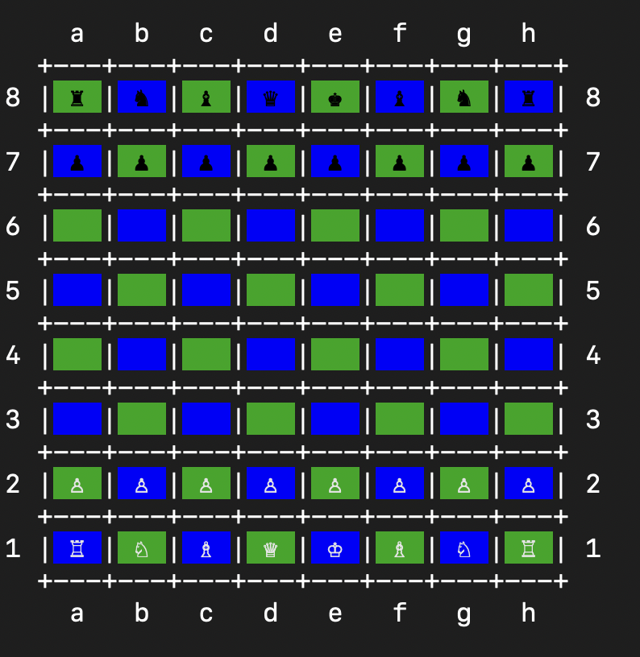

# Chess Game



## Overview

This is a command-line Chess game implemented in Ruby, allowing two players to engage in a classic game of chess. The game features standard chess rules, including piece movement, check, checkmate, and stalemate detection. It aims to provide a user-friendly experience while demonstrating object-oriented programming principles in Ruby.

## Features

- Two-player mode: Play against another human player.
- Standard chess rules: All pieces move according to traditional chess rules.
- Check and checkmate detection: The game automatically checks for check and checkmate conditions.
- Stalemate detection: The game identifies stalemate situations.
- Visual board representation: The chess board is displayed in the terminal with clear indicators for piece positions.

## Installation

1. Clone the repository:

   ```bash
   git clone https://github.com/PivtoranisV/chess-game.git
   ```

2. Navigate to the project directory:

   ```bash
   cd chess-game
   ```

3. Install the required gems:

   ```bash
   bundle install
   ```

## How to Play

1. Start the game by running the main Ruby file.

```bash
  bundle exec ruby main.rb
```

1. Follow the prompts to make moves, entering your move in standard chess notation (e.g., e2e4).
1. The game will display the current state of the board after each move.

## Code Structure

- **Board**: Manages the chess board, piece placement, and game rules.
- **Pieces**: Contains individual classes for each type of chess piece (e.g., King, Queen, Bishop, etc.), implementing their movement logic.
- **Player**: Handles player input and validates moves.
